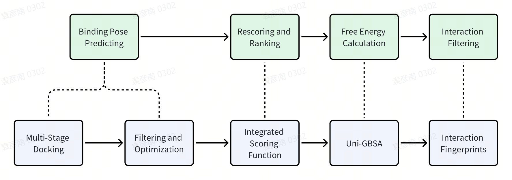

# virtual-screening-workflow

## Introduction
virtual-screening-workflow is a [***dflow***](https://github.com/deepmodeling/dflow) project for virtual screening intergrating multi-stage docking, filter and optimization, rescore and MM/PB(GB)SA into one workflow. The workflow process is

## Dependency

- GPU and CPU resources

    If you have your own cluster, you can use it, with a [Slurm](https://github.com/SchedMD/slurm). If you don't, we ***strongly recommand you to have a [Bohrium account](https://bohrium.dp.tech)*** and use machines in it.

- Argo Server

    You need to deploy an Argo Sever, a tutorial is [here](https://github.com/deepmodeling/dflow/blob/master/tutorials/readme.md). If you have a bohrium account, you can use the [bohrium workflow](https://lbg-workflow-dflow.dp.tech).

- Python >= 3.8

- [dflow](https://github.com/deepmodeling/dflow/tree/master)

    All you need is to run `pip install pydflow`

## Usage

Looking at the [config file](./config.json), put the local path of receptor on `receptor_file`, the local path of ligands dir on `ligands_dir`, and pocket info in all `center_x`, `center_y`, `center_z`, `size_x`, `size_y`, `size_z` in all sub params. Finally, put your bohrium account username, password, project_id (create in bohrium) in `bohrium_config`.